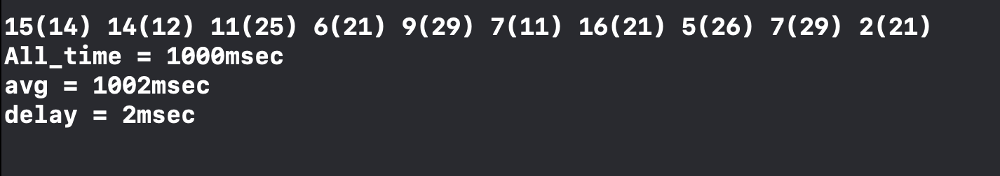
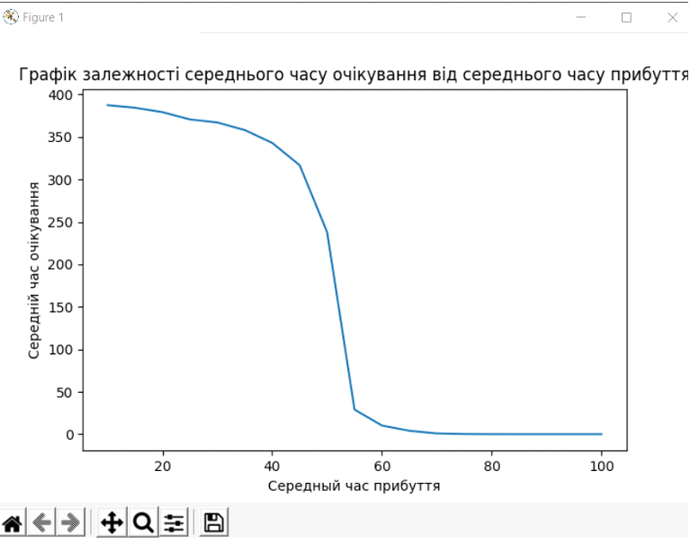
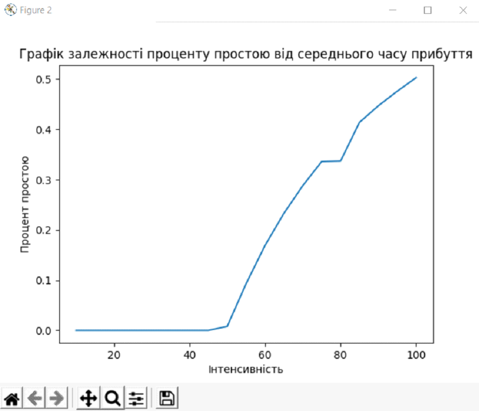
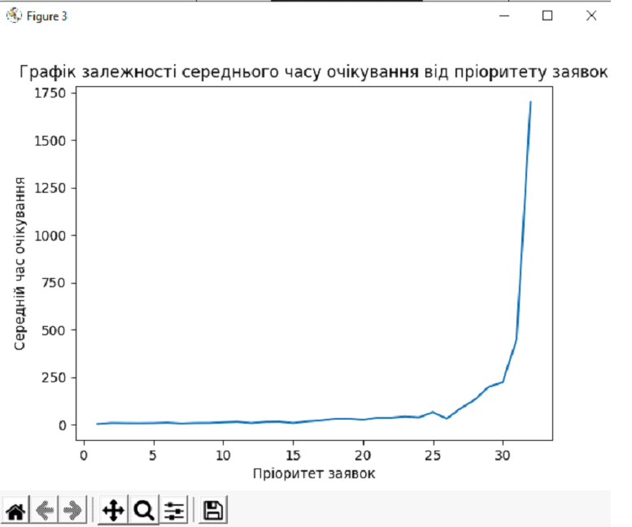

<h1>
    Process Manager with priority queue
</h1>
<h4>Priority Queue</h4>

    Priority Queue is an extension of queue with following properties.
     
    Every item has a priority associated with it.
     
    An element with high priority is dequeued before an element with low priority.
     
    If two elements have the same priority, they are served according to their order in the queue.

<h4>Code structure</h4>
    To complete the task my priority queue supports following operations.
    
    push(&que, item, priority): Inserts an item with given priority.
    top(&que): Returns the highest priority item.
    pop(&que): Removes the highest priority item.
    show(&que): Show all items with priority.
    orders(&que, size, from, to, Pfrom, Pto, _time): This is a service applications which show to us our orders one by one

<h4>Usage</h4>

To use the manager you need to create class pqueue que, than create function of orders and input parameters that you need it.

<h4>Examples</h4>

   Code:
  
    pqueue que;
    orders(que, 10, 0, 20, 10, 30, 1000);
    
Output:

<h4>Graphics</h4>

   

